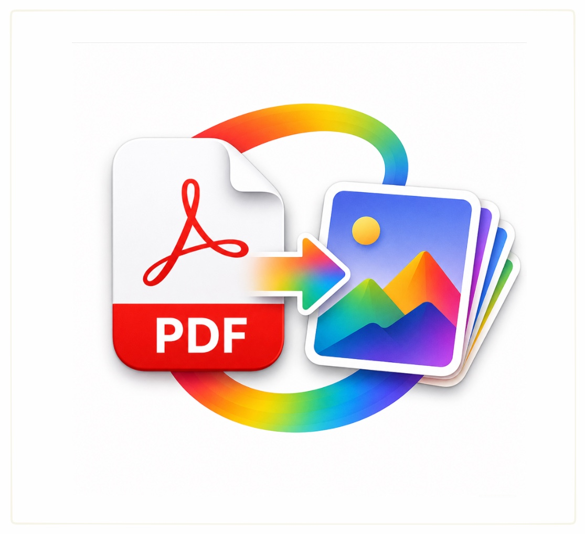

# PDF Convert Anything

PDF Convert Anything is a small macOS utility that turns each page of a PDF into a PNG image.

복잡한 설정 없이 PDF를 드래그하면 각 페이지가 원본 PDF와 같은 폴더에 PNG 파일로 저장됩니다.

[Download v1.0.0](https://github.com/eidenchoe-appstore/PDF-Convert-Anything/releases/download/v1.0.0/PDF-Convert-Anything-v1.0.0.dmg)

## Preview



## 기능

- Drag and drop PDF files into a compact macOS window
- Select one or more PDF files from Finder
- Convert every PDF page to PNG
- Save output images next to the original PDF
- Use deterministic slide-style output names
- Build a local `.app` bundle and installer DMG from scripts

## Output Naming

Output files use this pattern:

```text
{PDF file name}_slide_{page index}pages.png
```

Example:

```text
lecture.pdf
lecture_slide_1pages.png
lecture_slide_2pages.png
lecture_slide_3pages.png
```

## Requirements

- macOS 14 or later
- Apple Silicon Mac for the provided build

## Install

1. Download `PDF-Convert-Anything-v1.0.0.dmg` from [Releases](https://github.com/eidenchoe-appstore/PDF-Convert-Anything/releases/tag/v1.0.0).
2. Open the DMG.
3. Drag `PDF Convert Anything.app` into `Applications`.
4. Launch the app and drop a PDF file into the window.

The current public build is ad-hoc signed for direct distribution. If macOS shows a Gatekeeper warning, right-click the app in Finder and choose `Open`.

## Usage

1. Open `PDF Convert Anything`.
2. Drop one or more PDF files into the window, or click `PDF 선택`.
3. Wait for the progress bar to finish.
4. Click `출력 폴더` to open the folder containing the generated PNG files.

## Development

```bash
./script/build_and_run.sh
```

The Codex Run button is wired to the same script through `.codex/environments/environment.toml`.

Run tests:

```bash
swift test
```

## Build A DMG

```bash
./script/package_dmg.sh 1.0.0
```

생성물:

```text
dist/PDF Convert Anything.app
dist/PDF-Convert-Anything-v1.0.0.dmg
```

## Project Structure

```text
Sources/PDFConvertAnything/          SwiftUI app and UI state
Sources/PDFConvertAnythingCore/      PDF rendering and PNG export logic
Tests/PDFConvertAnythingCoreTests/   Conversion tests
Resources/AppIcon.icns               Compiled app icon
icon.icon/                           Icon Composer source document
script/                              Build, run, icon, and DMG scripts
```

## App Icon

The app icon source is `icon.icon`, an Apple Icon Composer document. The build script renders it with Icon Composer's `ictool`, then packages the generated iconset as `Resources/AppIcon.icns`.

## Tech Stack

- Swift 5.10
- SwiftUI
- CoreGraphics PDF 렌더링
- Swift Package Manager
- macOS 14 이상

## Release

Current release: [v1.0.0](https://github.com/eidenchoe-appstore/PDF-Convert-Anything/releases/tag/v1.0.0)

Release artifact:

```text
PDF-Convert-Anything-v1.0.0.dmg
```
